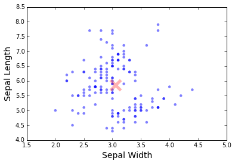

#Linear Algebra

First part of this exercise gives you some practice of matrix multiplication.

### Part 1: Markov Process, Stochastic Matrix

Suppose that the 2004 **state of land use** in a city of 60 mi^2 of built-up area is

C: Commercially Used 25%
I: Industrially Used 20%
R: Residentially Used 55%

1. Find the **state of land use** in 2009 and 2014, assuming that the transition
   probabilities for 5-year intervals are given by the matrix **A** and
   remain practically the same over the time considered.

   <div align="center">
    
   </div>

**Note:**
- _A_ is a stochastic matrix, that is, a square matrix with all entries
 nonnegative and all  column sums equal to 1.

- Our example concerns a Markov process, for which the probability of entering
  a certain state depends only on the last state occupied (and the matrix A),
  not on any earlier state


### Part 2: EDA of Fisher's Iris data

**IMPORTANT NOTE:**

In numpy array, the **row vector** is defined as:

```python
a = np.array([[1, 2, 3]])
```
The shape of `a` is `(1, 3)`.

A **column vector** is defined as:
```python
b = np.array([[1], [2], [3]])
```
The shape of `b` is `(3, 1)`.

Check the `shape` of all the vectors throughout the exercise.
If the shape is missing a value, i.e. `(3,)` or  `(,3)`, use `reshape()` to
restore the correct dimensions.

_**Do not** use a for loop at any point of the exercise_.

Here we will be exploring the Fisher's Iris data set. A lot of the
functions / operations are things you are already familiar with, such as
**mean** and **sum**. But we will frame those operations in linear algebra
terms. Linear algebra is done in python using the `numpy` library.


1. Read the `data/iris.txt` into a pandas dataframe. Select the
   columns `SepalWidth` and `SepalLength` and export them to a numpy array.
   **Remember which column is width / length. Exporting to numpy gets rid of
   the name of the column.**

   ```python
   import pandas as pd
   iris = pd.read_csv('data/iris.txt')

   # Export into a numpy object
   data = iris[['SepalWidth', 'SepalLength']].as_matrix()

   data.shape   #Output: (150, 2)
   ```
   Make a scatter plot of sepal width vs sepal length.

   ```python
   width = data[:, 0]
   length = data[:, 1]
   ```

2. Calculate the mean vector (column-wise) from the data matrix. You should
   get a `shape` of `(1, 2)`.


   Plot the vector (point) to show where the mean `SepalWidth` and mean
   `SepalLength` is.

   <div align="center">
    
   </div>

3. Obtain mean-centered data by subtracting mean vector from each data point.
   Check that the `shape` is `(150, 2)`.

4. Write a function to calculate the euclidean distance between two **column
   vectors (not row vector)**. Your function should return a single number.

   Use this to calculate the distance of every point in your data matrix
   from the mean vector. Use `np.apply_along_axis()`. The shape of your result
   should be `(150, 1)`.

   Plot a histogram of the euclidean distances.

5. Write a function to calculate the cosine similarity between two **column
   vectors (not row vector)**. Your function should return a single number.

   Use this to calculate the cosine similarity of every point in your data
   matrix from the mean vector. Use `np.apply_along_axis()`. The shape of your result
   should be `(150, 1)`.

   Plot histogram of the cosine similarities.


### Part 3: EDA of Fisher's Iris data (Extra Credit)

1. Write a function to calculate projection of one vector onto another vector.
   Use this function to calculate the projections of every point
   (using centered data) onto vector (1,1). Plot these projections along with the actual data points.

2. Now calculate the projections of all data points (using centered data) onto the vector (-1,1). Plot these projections. How do these projections differ from the previous one.
