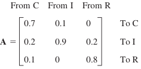

Include your answers to this part in `morning.py`.

**Please use numpy vector/matrix operations. Do not use a for loop unless given explicit instructions**

## Part 0: Important Numpy Notes:

In numpy array, the **row vector** is defined as:

```python
a = np.array([[1, 2, 3]])
```
The shape of `a` is `(1, 3)`.

A **column vector** is defined as:
```python
b = np.array([[1], [2], [3]])
```
The shape of `b` is `(3, 1)`.

Check the `shape` of all the vectors throughout the exercise.
If the shape is missing a value, i.e. `(3,)` or  `(,3)`, use `np.newaxis` to
restore the correct dimensions


## Part 1: Linear Algebra Practice:

- Suppose that the 2004 **state of land use** in a city of 60 mi^2 of built-up
   area is

   ```
   In 2004:
   
   C (Commercially Used): 25%
   I (Industrially Used): 20%
   R (Residentially Used): 55%
   ```

   1. Find the **state of land use** in **2009** and **2014**,
      assuming that the transition probabilities for 5-year intervals are given
      by the matrix **A** and remain practically the same over the time considered.
   
      <div align="center">
         
      </div>

- This question uses the `iris` dataset. Load the data in with the following code.
   
   ```python
   from sklearn import datasets
   # The 1st column is sepal length and the 2nd column is sepal width
   sepalLength_sepalWidth = datasets.load_iris().data[:, :2]
   ```
  
   1. Make a scatter plot of sepal width vs sepal length
  
   2. Compute the mean vector (column-wise) of the data matrix. The `shape`
      of the mean vector should be `(1, 2)`
     
      Plot the mean vector on the scatter plot in `1.` 

      <div align="center">
       
      </div>

   3. Write a function (`euclidean_dist`) to calculate the euclidean distance
      between two **column vectors (not row vector)**. Your function should check
      if the vectors are column vectors and the shape of the two vectors are the same .

   4. Write a function (`cosine_sim`) to calculate the cosine similarity_between 
      two **column vectors (not row vector)**.
   
   5. Write a function that would loop through all the data points in a given matrix and 
      calculate the given distance metric between each of the data point and the mean
      vector. **A for loop is allowed here**
      
      **Input of the function:**
         - Data matrix as an ndarray
         - Function to compute distance metric (Euclidean / Cosine Similarity)
      
      **Output of the function:**
         - An array shaped `(150, 1)`
      
      Use the function to compute Euclidean Distance and Cosine Similarity between each of
      the data points and the mean of the data points. You should be able to call the function
      in this manner:

      ```python
      euclidean_dists = compute_dist(sepalLength_sepalWidth, euclidean_dist)
      cosine_sims = compute_dist(sepalLength_sepalWidth, cosine_sim)
      ```
   6. Plot histograms of the euclidean distances and cosine similarities.
   
      <div align="center">
       
      </div>

      <div align="center">
       
      </div>


## Part 2: Markov

1. Write a function to calculate projection of one vector onto another vector.
   Use this function to calculate the projections of every point
   (using centered data) onto vector (1, 1). Plot these projections along with
    the actual data points.

2. Now calculate the projections of all data points (using centered data) onto
   the vector (-1, 1). Plot these projections. How do these projections differ
   from the previous one.
