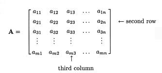
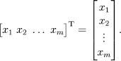
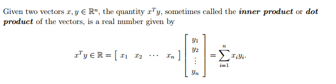
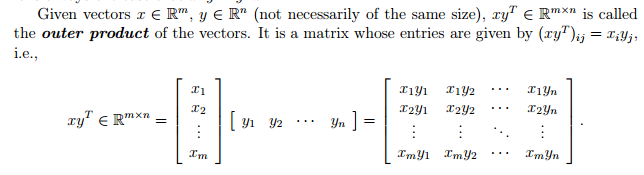
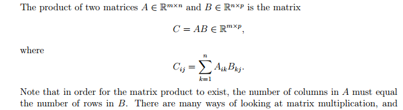
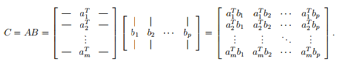
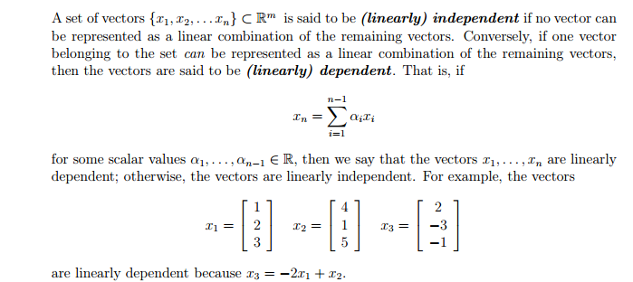

Linear Algebra
====================================

1. [What is Linear Algebra?](#what-is-linear-algebra?)
2. [Matrices vs Vectors (Notation)](#matrics-vs-vectors)
3. [Scalar Operations](#scalar-operations)
4. [Elementwise Operations](#elementwise-operations)
5. [Matrix Multiplication](#matrix-multiplication)
6. [Identity Matrix](#identity-matrix)
7. [Inverse/Determinant](#inverse/determinant)
8. [Rank](#rank)

What is Linear Algebra?
==============================

Linear algebra is about being able to solve systems of equations in an efficient manner.

Let's start with a basic example of an equation:

    4 x 1 - 5 x 2 = -13
   
    -2 x 1 + 3 x 2 = 9

If we think of `Ax = b`

Let's change this to matrices:

    A =  4 -5    
        -2  3
   
    b = -13
    9

Solving this by hand can take a long time. With matrices, there are a lot of established rules of math that come in to play that allows us to do computations efficiently.

Matrices vs Vectors
=====================================
Matrices are a 2d brick of numbers. Vectors are a 1d matrix.

Here is an example matrix

2 kinds of vectors, row and column. A row vector is a 1 x n vector where n is the number of columns. A column vector is an m x 1 vector where m is the number of rows. They are transposes of each other (review of that coming up).

Pictured below:

We can think of matrices and vectors as numerical primitives very similar to scalars (single numbers)

With that being the case, we can do various operations on them. 

The core idea of matrices and vectors is the ability to run numerical routines on large swathes of numbers at once in a fast fashion. This includes being able to operate on several blocks at once in parallel.

A bit of notation: `A^T` (or `A'`) is `A` trasnpose. This flips the columns and rows of the matrix. A quick example:

    A =   6  10   9   7
         11   1   3   8
          2  -3   5  -5

    A' =  6  11   2
         10   1  -3
          9   3   5
          7   8  -5

Scalar Operations
==================================
Matrices can actually have a  number applied element wise to each. This is called a scalar operation.

In python and other languages, a scalar (again: single number) is typically represented as a scalar matrix.

Example being:

    [2]
    
A scalar matrix is a 1 x 1 matrix that can then typically be blended with any matrix operations natively.

A quick example:

    2 3 5   + 1   =   3 4 6
    4 5 6             5 6 7

For all intents and purposes a matrix A, scalar matrix B, and scalar x where x is the only element in the 
matrix B are the following:

    A + B = A + x

This rule applies to all operations involving a scalar matrix.

Elementwise operations
=======================================
For any matrix A or B, an elementwise operation on a matrix can only happen when the matrices are the same shape.

With that assumption:

Let f(A,B) be a transformation over the elements i,j and A and B, and Y be a result of f(A,B):

    Y_i,j = f(A_i,j,B,i,j)

An example:

      A        B
    [2,2]    [1,1]
    [3,3]    [2,2]

    A + B = [3,3]
            [5,5]

Matrix Multiplication
===================================
Different from element wise matrix multiplication, a matrix matrix multiply can only happen when the columns of the first matrix are the same as the rows of the second matrix. 

Let's identify suboperations of a matrix multiply. This can help contextualize the general case.

## Inner Product (aka Dot Product)
An Inner product, or dot product is as follows:

Of note here is that x is a row vector and y is a column vector.

## Outer product

Of note here is that x is a column vector and y is a row vector.

## Matrix - Matrix multiply
A matrix multiply is as follows:

A readable version of this: for each i,j in your matrix that will be the number of columns in the first x number of rows in the second, Multiply the row of the first matrix by the column of the second and sum over all the results to form an individual cell where the current row or column is i,j.

We can think of a matrix multiply as a series of vector-vector products. That is that the (i, j)th entry of an output C is equal to the inner product of the ith row of A and the jth column of B.
Symbolically, this looks like the following:

Let's do a quick example:

     A = [1, 2]
         [3, 4]
    
     B = [9, 7]
         [5, 8]
    
    AB = [1*9+2*5, 1*7+2*8]  =  [19, 23]
         [3*9+4*5, 3*7+4*8]     [47, 53]

#### Numpy gotcha
`A * B` is the *elementwise* multiplication:

    A * B = [ 9, 14]
            [15, 32]

If you want to do matrix multiplication, use `np.dot`:

`np.dot(A, B)` or `A.dot(B)`

Notice how the 2 are different. A matrix matrix multiply is applying columns to rows. The number of columns in the first matrix must equal the number of rows in the second.

An elementwise matrix multiplication requires (as with all elementwise operations) that the two matrices have the same dimensions.

Identity Matrix
==================================
An identity matrix is a square matrix with all 1s on the diagonal zeros everywhere else.

Below is the 3x3 identity matrix:

    A = 1   0   0
        0   1   0
        0   0   1

The following is true for all matricies:

    A * I = A

Rank
=========================
Rank is about finding dependent rows and columns in a matrix. A dependent row (or column) is a a row (or column) that is a linear combination of other rows (or columns).

Some examples of this:

* a row that is a multiple of another row
* a column that is the sum of two other columns

Rank is the number of linearly independent rows or columns in a matrix.

Formalizing this a bit:

For any matrix A ∈ R m×n, the row or column rank is the largest subset of rows or columns that are linearly independent.

The following are some basic properties of the rank:

• For A ∈ R m×n , rank(A) ≤ min(m, n). If rank(A) = min(m, n), then A is said to be full rank.
• For A ∈ R m×n , rank(A) = rank(A^T).
• For A ∈ R m×n , B ∈ R n×p , rank(AB) ≤ min(rank(A),rank(B)).
• For A, B ∈ R m×n , rank(A + B) ≤ rank(A) + rank(B)

Inverse and Deterimanant
==================================
An inverse of a matrix is defined as follows:

    A^−1 A = I = A A^−1

A matrix that has an inverse is called invertible.

In order for a square matrix `A` to have an inverse `A^−1`, then `A` must be full rank (no dependent columns)
