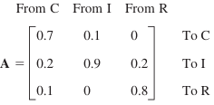
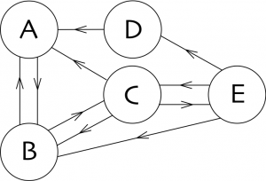

## Part 1: Eigenvalue Problems Arising from Markov Processes

Markov processes as considered in morning sprint lead to eigenvalue problems if
we ask for the limit state of the process in which the state vector **x** is
reproduced under the multiplication by the stochastic matrix **A** governing
the process, that is, **Ax** = **x**. Hence **A** should have the eigenvalue 1,
and **x** should be a corresponding eigenvector. This is of practical interest
because it shows the long-term tendency of the development modeled by the process.

1. Lets reconsider the stochastic matrix from the morning sprint:

   

    
   

   Find the eigenvector for this matrix corresponding to the eigenvalue of 1.

## Part 2: PageRank

Here we will be implementing the most basic form of the algorithm that made
[Google the company it is today](http://en.wikipedia.org/wiki/PageRank).

Read more about the algorithm
[here](http://books.google.com/books/p/princeton?id=5o_K4rri1CsC&printsec=frontcover&source=gbs_ViewAPI&hl=en#v=onepage&q&f=false)
if you are interested.

 

For this exercise we will be working with a simple network of websites.

   

    
   

**In the above image:**

- Each node is a web page
- Each directed edge corresponds to one page referencing the other
- These web pages correspond to the states our Markov chain can be in
- Assume that the model of our chain is that of a random surfer/walker.

In this model, we transition from one web page (state) to the next with
equal probability (to begin).  Or rather we randomly pick an outgoing edge
from our current state.  Before we can do any sort of calculation we need to
know how we will move on this Markov Chain. **We will start off with a very
explicit way of calculating our transitions using dictionaries and then we
will see linear algebra can simplify the implmentation**.

## Part 3: Dictionary Implementation

1. Create a dictionary representing **the image above** and the transitions
   between its nodes. Each key in this dictionary will correspond to a
   node/state and its value will be another dictionary.
   The value dictionary will correspond to the probabilities of transitioning
   to another node. _**Do not use a matrix for this part**_.

2. Now that we know how to transition our random walker from one state to the
   next we can start walking!

   Write a function that takes as input this transition dictionary and a
   dictionary of probabilities of where our surfer is and returns the
   probabilities of where they end up after one step.  To calculate where they
   will end up simply multiply the probability that they are in a given state,
   times each of the probabilities to transition out of that state.

3. Our surfer will be initialized on a random page, the list of probabilities
   input to the previous function will be uniform over all states
   (and sum to one).  Take one step on the chain (iteration) by running the a
   bove function with the random surfer probability list.

   What is the most probable page to be on after on step?

4. The PageRank metric actually corresponds to the "stationary distribution" of
   the chain. The stationary distribution is the limiting distribution of the
   Markov chain when iterated. Or rather the configuration that another
   iteration/step does not change the probability distribution of our surfer and
   represents the likelihood that our random surfer is on a page after a very
   long time of random surfing.

   To calculate the stationary distribution of the chain, write a function that
   iterates on the chain (takes steps) until the probability distribution of the
   surfer does not change from one step to the next.

   **Note: The probability vector should always sum to one at each step. Include
   a function to normalize the probabilities to make the sum of all probabilities
   1.**

5. How many iterations did it take to reach stationary distribution?

   What is the page with the highest page rank (most probable to be on)?

## Part 4: Linear Algebra Implementation

Hopefully the above process made you think of matrices! Often PageRank is
formalized using linear algebra. In this alternative formulation the PageRank
corresponds to the principal eigenvector (largest) of the transition matrix.

 

1. Using numpy, create the transition probabilities in a matrix form for this
   simple web where position _i_, _j_ in the matrix corresponds to the
   probability of going from state _i_ to state _j_.

2. Now that we have a transition matrix, the next step is to iterate on this
   from one page to the next (like someone blindly navigating the internet) and
   see where we end up. The probability distribution for our random surfer can
   be described in this matrix notation as well (or vector rather).

   Initialize a vector for the probability of where our random surfer is.
   It will be a vector with length equal to the number of pages.
   Initialize it to be equally probable to start on any page
   (i.e. you start randomly in a state on the chain).

3. To take a step on the chain, simply matrix multiple our user vector by the
   transition matrix.
   After one iteration, what is the most likely location for your random surfer?

4. Plot how the probabilities change.
   Iterate the matrix through the first ten steps.
   At each step create a bar plot of the surfers probability vector.
   (or if you want to get fancy you can plot everything on one
   [3 dimensional plot](http://matplotlib.org/mpl_toolkits/mplot3d/tutorial.html)
   by representing time in the z direction).

5. This time to compute the stationary distribution, we can use numpy's
   matrix operations. Using the function for calculating [eigenvectors](http://docs.scipy.org/doc/numpy/reference/generated/numpy.linalg.eig.html) compute the
   stationary distibution (page rank).  Is it the same as what you found
   from above?  What is it's eigenvalue?

## Part 5: Extra Credit (More PageRank)

### A real web

Now that you have explored and gotten a sense for a simple graph, it is time to
apply and use your function on a much larger graph.

1. Download the High Energy Physics citation
   [network](http://snap.stanford.edu/data/cit-HepTh.html).
   Use your function to calculate the PageRank of each node.

2. Which paper has the highest pagerank?

3. Check your results by using GraphLab's
   [pagerank](http://graphlab.com/products/create/docs/graphlab.toolkits.graph_analytics.html#pagerank). (Graphlab should already be installed for you.)

   Do the results match?  Why might they not match?
