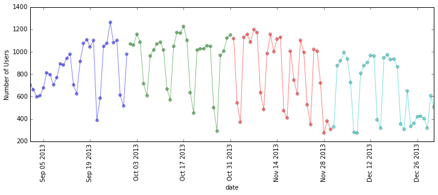
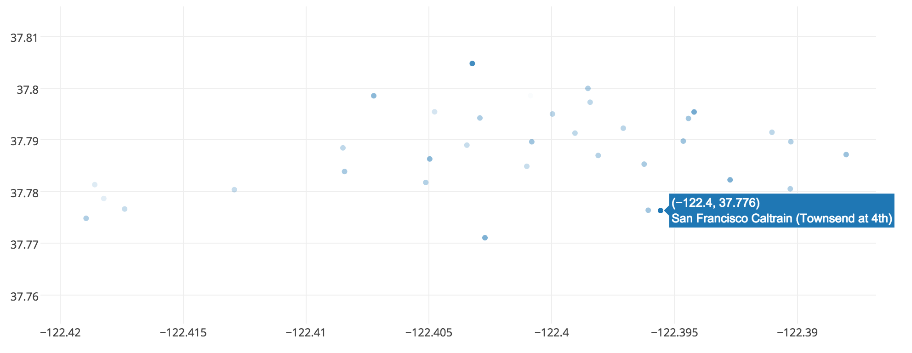

Include your answer in `afternoon_answer.md`

##Part 0: Exploratory Data Analysis (EDA)

EDA is a crucial step in the process of building a predictive model. EDA helps you understand the characteristics
of your data and the relationships between your variables through visualizing and summarizing your data. Here we 
will walk through an example of doing so.

 
 
In this scenario, you are a data scientist at [Bay Area Bike Share](http://www.bayareabikeshare.com/). Your task
is to provide insights on bike user activity to the products team in order to better strategize their advertisement. 

1. Load the file `201402_trip_data.csv` into a dataframe. Explore the user activity at each hour of the day
   over the 7 month period the data spans. 
   
   **Below are some guidelines you can follow:**
   - Make `Start Time` a datetime column using the `parse_dates` argument in the 
    [`pd.read_csv`](http://pandas.pydata.org/pandas-docs/stable/generated/pandas.io.parsers.read_csv.html) function 
   - Since we are interested in user count by the hour, create columns which are the `date` and `hour` of the `Start Time`
     ([Hint](http://stackoverflow.com/questions/25129144/pandas-return-hour-from-datetime-column-directly))
   - Groupby `date` and `hour` and count the number of users in a given hour on a specific date
   - Groupby `hour` only to get all the variations of user activity for a given hour over all the dates 
   
2. Make a [boxplot](http://blog.bharatbhole.com/creating-boxplots-with-matplotlib/) of the hours in the day **(x)**
   against the number of users **(y)** in that given hour. 
   
   Someone from the analytics team made a line plot (_right_) that he claims is showing the same information as your
   boxplot (_left_). Why is that not true in general? Describe the insight you have gain from your boxplot.
   Provide an explanation as to why the interquartile range (IQR) of the boxplot at hour `8, 9, 18, 19` is wider
   than the rest. The answer is not straightforward, so move on to the next question if you are spending more than
   5 minutes on the explanation.
   
   

3. Make a `dayofweek` column that indicates the day of week. Reproduce the same boxplot in `2.` using weekday and weekend 
   data respective. Label the weekday and weekend boxplots respectively. Inspect your plots and describe the differences
   between weekend and weekday user activities. Is there any outstanding observations on the weekday you would like to
   investigate further? If so, what are they and what are the dates? Do they make sense?
   
4. There are two types of bike users (specified by column `Subscription Type`: `Subscriber` and `Customer`. Given this
   information and the weekend and weekday categorization, plot and inspect the user activity trends. Suppose the 
   product team wants to run a promotional campaign, would you suggest them do it on a weekday or weekend, and
   during what time in the day? Why?

5. In real life, you are likely to work with data that is messy or incomplete. Inspect the number of users per month. 
   Plot **month** against **number of user**. What do you observe? Plot the daily number of users from September to
   December.

   

6. 

   
