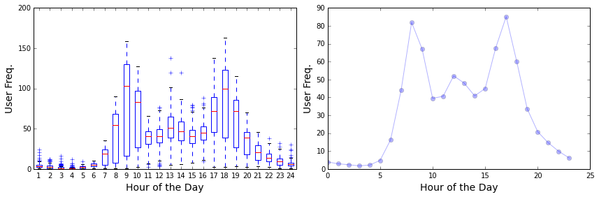

Include your answer in `afternoon_answer.md`

##Part 0: Exploratory Data Analysis (EDA)

EDA is a crucial step in the process of building a predictive model. EDA helps you understand the characteristics
of your data and the relationships between your variables through visualizing and summarizing your data. Here we 
will walk through an example of doing so.

<br>
 
In this scenario, you are a data scientist at [Bay Area Bike Share](http://www.bayareabikeshare.com/). You are
interested in understanding the factors that drives bike sharing activity so you can better inform the marketing 
team about its advertisement strategies. 

1. Load the file `201402_trip_data.csv` into a dataframe. Explore the user activity at each hour of the day
   over the 7 month period the data spans. 
   
   **Below are some guidelines you can follow:**
   - Make `Start Time` a datetime column using the `parse_dates` argument in the 
    [`pd.read_csv`](http://pandas.pydata.org/pandas-docs/stable/generated/pandas.io.parsers.read_csv.html) function 
   - Since we are interested in user count by the hour, create columns which are the `date` and `hour` of the `Start Time`
     ([Hint](http://stackoverflow.com/questions/25129144/pandas-return-hour-from-datetime-column-directly))
   - Groupby `date` and `hour` and count the number of users in a given hour on a specific date
   - Groupby `hour` only to get all the variations of user activity for a given hour over all the dates 
   
2. Make a [boxplot](http://blog.bharatbhole.com/creating-boxplots-with-matplotlib/) of the hours in the day **(x)**
   against the number of users **(y)** in that given hour. 
   
   Someone from the analytics team made a line plot (_right_) that he claims is showing the same information as your
   boxplot (_left_). Why is that not true in general? Describe the insight you have gain from your boxplot.
   Provide an explanation as to why the interquartile range (IQR) of the boxplot at hour `8, 9, 18, 19` is wider
   than the rest. The answer is not straightforward, so move on to the next question if you are spending more than
   5 minutes on the explanation.
   
   

3. Make a `dayofweek` column that indicates the day of week. Reproduce the same boxplot in `2.` using weekday and weekend 
   data respective. 

## Data Exploration and Graphing
You will be exploring and graphing data from the Bay Area Bike Share. Download the data and review it well enough to understand the contents.  The data directory contains a README with further explanation.

This assignment has three parts

1. Create a graph that is based on data from only one of the columns of the original data.  For example, this might be a histogram of that data.

2. Create a graph that is based on data from only two columns of the original data.  This might me a scatterplot, a faceted histogram, etc.

3. Create graph that is based on data from at least 3 columns of the original data.  This could be a colored scatterplot, a scatterplot matrix, faceted histograms, etc.

For each of the three parts, your goal should be to create the most interesting or insightful graph you can given the constraints on how much data is used.  Create a separate document that explains why you find each graph insightful and/or what you learn from the results.


```
1. CRIM      per capita crime rate by town
    2. ZN        proportion of residential land zoned for lots over 
                 25,000 sq.ft.
    3. INDUS     proportion of non-retail business acres per town
    4. CHAS      Charles River dummy variable (= 1 if tract bounds 
                 river; 0 otherwise)
    5. NOX       nitric oxides concentration (parts per 10 million)
    6. RM        average number of rooms per dwelling
    7. AGE       proportion of owner-occupied units built prior to 1940
    8. DIS       weighted distances to five Boston employment centres
    9. RAD       index of accessibility to radial highways
    10. TAX      full-value property-tax rate per $10,000
    11. PTRATIO  pupil-teacher ratio by town
    12. B        1000(Bk - 0.63)^2 where Bk is the proportion of blacks 
                 by town
    13. LSTAT    % lower status of the population
    14. MEDV     Median value of owner-occupied homes in $1000's
```


####Column Counting Caveats
- If you use a feature to column to filter to a subset of the data, and plot that subset, the feature you filtered on doesn't count towards the column count (unless you also directly plot it). 
- If you derive new columns from a single column of raw data, you can plot as many derived features as you want, and it only counts as a single column (since it came from a single raw column)

Files contain data from  3/1/14 to 8/31/14.

1) REBALANCING DATA
FILE = "201408_rebalancing_data.csv"
-station_id: station ID number (use "201408_station_data.csv" to find corresponding station information)
-bikes_available: number of available bikes
-docks_available: number of available docks
-time: date and time, PST

2) STATION INFORMATION
FILE = "201408_station_data.csv"
-station_id: station ID number (corresponds to "station_id" in "201408_rebalancing_data.csv")
-name: name of station
-lat: latitude
-long: longitude
-dockcount: number of total docks at station
-landmark: city (San Francisco, Redwood City, Palo Alto, Mountain View, San Jose)
-installation: date that station was installed 

3) TRIP DATA
FILE = "201408_trip_data.csv"
-Trip ID: numeric ID of bike trip
-Duration: time of trip in seconds
-Start Date: start date of trip with date and time, in PST
-Start Station: station name of start station
-Start Terminal: numeric reference for start station
-End Date: end date of trip with date and time, in PST
-End Station: station name for end station
-End Terminal: numeric reference for end station
-Bike #: ID of bike used
-Subscription Type: Subscriber = annual member; Customer = 24-hour or 3-day member
-Zip Code: Home zip code of user (only available for annual members)

4) WEATHER DATA
FILE = "201408_weather_data.csv"
Daily weather information per service area. Weather is listed from north to south (San Francisco, Redwood City, Palo Alto, Mountain View, San Jose).
	
-Max_Visibility_Miles 	
-Mean_Visibility_Miles 	
-Min_Visibility_Miles 	 		
-Precipitation_In 	"numeric, in form x.xx but alpha ""T""= trace when amount less than .01 inch"	
-Cloud_Cover 	"scale of 0-8, 0=clear"	
-Events	"text field - entries: rain, fog, thunderstorm"	
-zip code: 94107=San Francisco, 94063=Redwood City, 94301=Palo Alto, 94041=Mountain View, 95113= San Jose"	