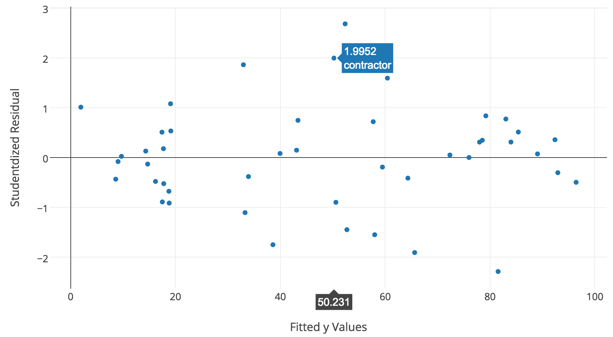

Include your answers to this afternoon's exercies in `afternoon.py`.

This afternoon you will be introduced to the basics of linear regression.

## Part 0: Solving the Normal Equation

The beta coefficients of a linear regression model can be calculated by
solving the normal equation. 


1. Load the data in by the following code:

   ```python 
   import statsmodels.api as sm
   prestige = sm.datasets.get_rdataset("Duncan", "car", cache=True).data
   y = prestige['prestige']
   x = prestige[['income', 'education']].astype(float)
   ```
   
   **Hint:**
   - **The features (x) should be scaled (centered by mean and divided by standard deviation)**
   - **After scaling, append a column of 1's to the feature matrix (x),
     so an intercept can be fitted.**


2. Using numpy, write a function that solves the **normal equation** (below).
   As input your function should take a matrix of features (**x**) and
   a vector of target (**y**). You should return a vector of beta coefficients 
   that represent the line of best fit which minimizes the residual. 
   Calculate  R<sup>2</sup>. 
   
   <div align="center">
      
   </div>

3. Verify your results using statsmodels. Use the code below as a reference.
   ```python
   import statsmodels.api as sms
   model = sms.OLS(y, x).fit()
   summary = model.summary()
   ```

## Part 1: Linear Regression Diagnosis

The linear regression model makes a number of assumptions about the data, including 

- **Homoscedasticity of residuals**
- **Normal distribution of residual**
- **Lack of mutlicollinearity between features**
- **Lack of autocorrelation (if the data is a time series)**

Since the results of the regression model depend on these statistical assumptions, the 
results are only correct of our assumptions hold (at least approximately).

Using the fitted model above with the prestige data, answer the following questions

1. Use the **Goldfeld-Quandt** test (`sm.stats.diagnostic.het_goldfeldquandt`) to 
   assert the homoscedasticity of the residuals

2. Use the **Jarque-Bera/Omnibus** test (included in model summary) to assert to the 
   normality of the residuals. 
     
3. Use the **Condition Number** (included in model summary) to assert the lack of multicollinerity.
   As a rule of thumb, a condition number > 30 indicates multicollinearity between the features.
   
   Furthermore, we can use the **Variance Inflation Factor (VIF)** 
   (`sm.stats.outliers_influence.variance_inflation_factor`) to measure how collinear a particular 
   feature is with the rest of the features. As a rule of thumb, a VIF > 10 indicates the feature is
   collinear with at least another feature.
   
   **Hint:**
   - `variance_inflation_factor` takes a matrix of features and the column index of the feature the VIF
     is to be calculated
   - Write a function that loops through and calculate VIF for all the features
   
## Part 2: Interpreting beta coefficients

1. Examine and interpret the beta coefficients of income and education of the model 
   
## Part 3: Interpreting the residuals 

Plotting the residuals allows you identify outliers which represents data points where
the prediction by the model deviates much from the actual value.

1. Plot the fitted y value against studendized residuals (residual divided by standard deviation of residuals)
   
   **Hint:** 
   - **Use `summary.resid` and `summary.fittedvalues` to get the 
     residuals and the fitted y values**
   - **Use `plotly` to make the plot so the points will be labeled and 
     you can easily refer back to the points with large residuals 
     (`> 2` or `< -2`)**
   
   <br>
   
   <div align="center">
      
   </div>

2. Identify the points with large residuals (more than 2 standard deviations).
   Plot **income against studendized residuals** and **education against studendized residuals**
   and explain outliers in terms of income and education.
   
3. In addition to residuals, the measure of influence indicates how much effect a data point has on
   the model (i.e. flutuations in beta coefficients). Outliers with large residuals and large 
   [leverage](http://en.wikipedia.org/wiki/Cook%27s_distance) are influential and should be treated 
   with caution.
   
   Plot the **Influence Plot** (`sm.graphics.influence_plot`) and identify the influential points
   
4. Remove the influential points identified in `3.` and re-fit the model. Describe the differences 
   you observe in beta coefficients of the new model 


## Part 4: Partial Regression Plot and Partial Residual Plot

1. 