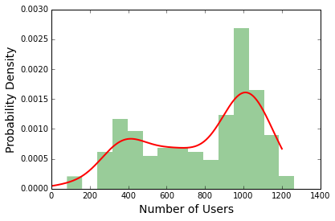
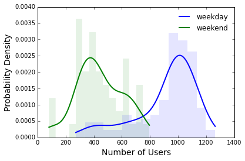

Include your answer in `afternoon_answer.md`

##Part 1: Exploratory Data Analysis (EDA)

Exploratory data analysis is a first crucial step to building predictive models from your data. EDA allows you
to confirm some of the assumptions you are making about your data and understand relationships between your variables.
 
 
 
In this scenario, you are a data scientist at [Bay Area Bike Share](http://www.bayareabikeshare.com/). Your task
is to provide insights on bike user activity and behavior to the products team. 

1. Load the file `201402_trip_data.csv` into a dataframe. Provide the argument `parse_dates=['Start Date', 'End Date']`
   with `pandas.read_csv()` to read the columns in as datetime objects. 
   
   Make 4 extra columns from the `Start Date` column (We will use these in later questions):
   - `month` would contain only the month component
   - `dayofweek` would indicate what day of the week the date is
   - `date` would contain only the date component 
   - `hr` would only contain the hour component
   - [Hint to deal with datetime objects](http://stackoverflow.com/questions/25129144/pandas-return-hour-from-datetime-column-directly)

2. Group the bike rides by `month` and count the number of users per month. Plot the number of users for each month. 
   What do you observe? Provide a likely explanation to your observation. Real life data can often be messy/incomplete
   and cursory EDA is often able to reveal that.
   
3. Plot the daily user count from September to December. Mark the `mean` and `mean +/- 1.5 * Standard Deviation` as 
   horizontal lines on the plot. This would help you identify the outliers in your data. Describe your observations. 
   
   

4. Plot the distribution of the daily user counts for all months as a histogram. Fit a 
   [KDE](http://glowingpython.blogspot.com/2012/08/kernel-density-estimation-with-scipy.html) to the histogram.
   What is the distribution and explain why the distribution might be shaped as such. 
    
   
  
   Replot the distribution of daily user counts after binning them into weekday or weekend rides. Refit  
   KDEs onto the weekday and weekend histograms.
   
   

5. 

Explore the user activity at each hour of the day
   over the 7 month period the data spans. 
   
   **Below are some guidelines you can follow:**
   - Make `Start Time` a datetime column using the `parse_dates` argument in the 
    [`pd.read_csv`](http://pandas.pydata.org/pandas-docs/stable/generated/pandas.io.parsers.read_csv.html) function 
   - Since we are interested in user count by the hour, create columns which are the `date` and `hour` of the `Start Time`
     ()
   - Groupby `date` and `hour` and count the number of users in a given hour on a specific date
   - Groupby `hour` only to get all the variations of user activity for a given hour over all the dates 
   
2. Make a [boxplot](http://blog.bharatbhole.com/creating-boxplots-with-matplotlib/) of the hours in the day **(x)**
   against the number of users **(y)** in that given hour. 
   
   Someone from the analytics team made a line plot (_right_) that he claims is showing the same information as your
   boxplot (_left_). Why is that not true in general? Describe the insight you have gain from your boxplot.
   Provide an explanation as to why the interquartile range (IQR) of the boxplot at hour `8, 9, 18, 19` is wider
   than the rest. The answer is not straightforward, so move on to the next question if you are spending more than
   5 minutes on the explanation.
   
   

3. Make a `dayofweek` column that indicates the day of week. Reproduce the same boxplot in `2.` using weekday and weekend 
   data respective. Label the weekday and weekend boxplots respectively. Inspect your plots and describe the differences
   between weekend and weekday user activities. Is there any outstanding observations on the weekday you would like to
   investigate further? If so, what are they and what are the dates? Do they make sense?
   
4. There are two types of bike users (specified by column `Subscription Type`: `Subscriber` and `Customer`. Given this
   information and the weekend and weekday categorization, plot and inspect the user activity trends. Suppose the 
   product team wants to run a promotional campaign, would you suggest them do it on a weekday or weekend, and
   during what time in the day? Why?

5. Incomplete/missing data is a commonality when dealing with real data. Make a plot of the **number of user** in 
   each month. Comment on the availability of the data. Plot the daily number of users from September to
   December. 

   

6. 

   

##Part 2: Intro to Linear Regression